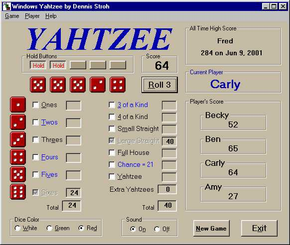



## Yahtzee 4 Player Part 1

### Description

This is a full version game with complete source code. It is colorful, easy and fun to play.

Although the code is commented, I also used long variable names to make the code sort of self-commenting.

The game, I think is a fairly robust version of Yahtzee with these helpful features:

* Tips on the point value of the dices after each roll,

* Highlighting of those scoring categories which will yield points

* Sound effects (which can be muted)

* Dice color choices

* A help section

* Four player capability

* Ability to save a game in progress

* Tracking of top 10 high scores

This is part 1. Part 2 has help form and associated images (which I am having trouble uploading)
 
### More Info
 

             |
---                |---
**Submitted On**   |2001-06-22 19:49:20
**By**             |[Dennis Stroh](https://github.com/Planet-Source-Code/PSCIndex/blob/master/ByAuthor/dennis-stroh.md)
**Level**          |Intermediate
**User Rating**    |4.8 (24 globes from 5 users)
**Compatibility**  |VB 5\.0, VB 6\.0
**Category**       |[Games](https://github.com/Planet-Source-Code/PSCIndex/blob/master/ByCategory/games__1-38.md)
**World**          |[Visual Basic](https://github.com/Planet-Source-Code/PSCIndex/blob/master/ByWorld/visual-basic.md)
**Archive File**   |[Yahtzee 4 216016242001\.zip](https://github.com/Planet-Source-Code/dennis-stroh-yahtzee-4-player-part-1__1-24383/archive/master.zip)

